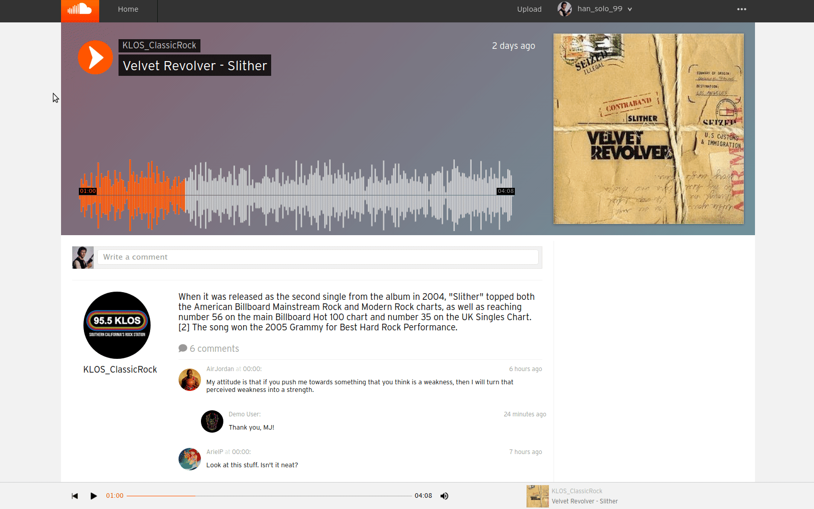
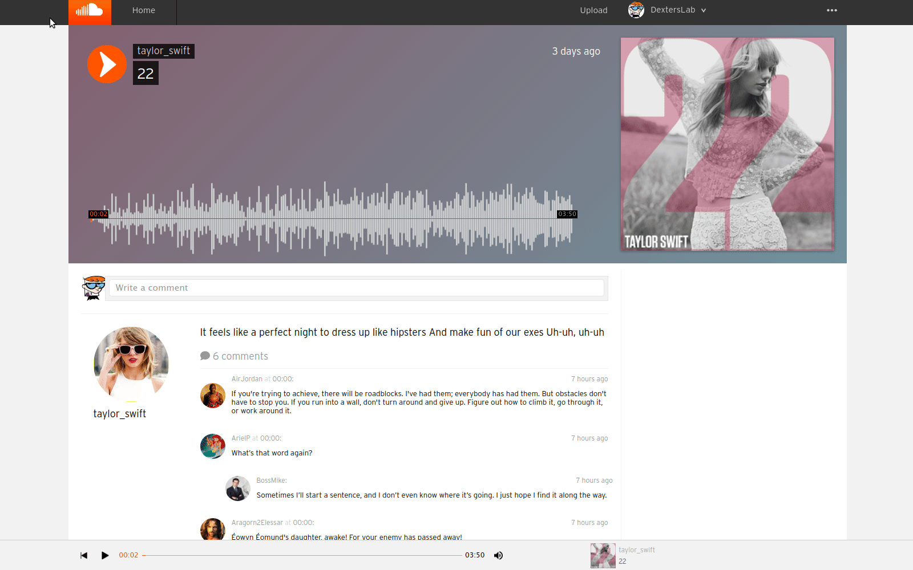

# <a href="https://soricloud.herokuapp.com/"></a> SoriCloud - a SoundCloud Clone
**[SoriCloud](https://soricloud.herokuapp.com/ "Go to SoriCloud")** is a single-page app for streaming music and uploading your own.

## Table of contents
* [General Info](#general-info)
* [Technologies](#technologies)
* [Features](#features)
  * [Unique signup/login flow](#unique-signuplogin-flow)
  * [Continuous audio playback through navigation](#continuous-audio-playback-through-navigation)
  * [Interactive waveform synced with music player bar](#interactive-waveform-synced-with-music-player-bar)
  <!-- * [Easy audio upload with responsive and intuitive UI](#easy-audio-upload-with-responsive-and-intuitive-ui) -->
* [Future Directions](#future-directions)
* [Contact](#contact)

## General Info
From the classic waveform visualizations to the intuitive interface for uploading your own music, [SoriCloud](https://soricloud.herokuapp.com/ "Go to SoriCloud") recreates the signature look of the original website and many of its functionalities. The overarching theme is ease of access to share your music with the rest of the world that originally captured the hearts of many grassroots musicians and bedroom producers.

Working on this clone of SoundCloud has been a source of continued learning. It's given me experience and valuable insight into the process of full stack development.

## Technologies
* React - v16.11.0
* Redux - v4.0.4
* Ruby on Rails - v5.2.3
* PostgreSQL - v12.2
* AWS S3

## Features
> An in-depth discussion of select features including details of my implementations and challenges faced

### Unique signup/login flow
SoriCloud recreates the unique signup and login flow of the original website with responsive and fluid design.

SoundCloud's user authentication process is unique. It uses a single form to handle both new and returning users, and it doesn't care if a returning user enters their username or email to log in. It has a single multi-step form to handle all these cases. In fact, even though the splash page contains three separate buttons (*Sign in*, *Create account*, and *Demo*), they all open the exact same form.

The screen recording below demonstrates creating a user, logging out, and then signing in again using both username and email while also showcasing custom error messages. Additionally, I used React refs to automatically focus text inputs for users while filling out the multi-step form for a more fluid experience.


The modal for the form was implemented with Redux by maintaining a slice of global UI state for modals and dispatching actions to open and close them.

Being able to handle both email and username via a single text `input` element was more difficult and involved than it seemed at first glance. It required setting up a custom backend route as well as creating another slice of front-end state to keep track of the `loginType` (either *login* or *signup*) and `loginInput` (the actual user input string).

When a user starts the multi-step form and types in the first input field and submits, their input is first checked to determine whether it is an email address (includes characters `@` and `.`). Then their input is checked against the `email` or the `username` column of the `User` table, accordingly. If an existing account is found, the user proceeds to the second and final step to input their password. If an existing account is not found but the user input is a valid email, the user proceeds to a signup form where the email address is already populated and is prompted to choose a password. Then, the user can continue to the final step of choosing a username before being logged in. If an existing account is not found and the user input is not a valid email, the form displays an error message prompting the user to enter a valid email or username.

Working on this implementation from this custom backend route in Rails through the steps of Redux and then finally to the React forms really helped me to understand the various steps that connect an end user's input all the way to the database.

The following excerpt from the `UsersController` illustrates the custom backend route:

```ruby
class Api::UsersController < ApplicationController
  def check_login_input
    is_email = is_email?(params[:loginInput])
    if is_email
      @user = User.find_by(email: params[:loginInput])
    else
      @user = User.find_by(username: params[:loginInput])
    end

    if @user
      render json: {loginInput: params[:loginInput], loginType: 'login'}
    elsif is_email
      render json: {loginInput: params[:loginInput], loginType: 'signup'}
    else
      render json: ['Enter a valid email address or username.'], status: 422
    end
  end

  private

  def is_email?(loginInput) 
    loginInput.include?('@') && loginInput.include?('.')
  end
end
```

Privacy and autonomy for users are ensured through additional front and backend authentication measures including BCrypt and customized React-Router higher-order components.

---

### Continuous audio playback through navigation
Users can navigate to different pages within the website without interrupting the currently playing track. Clicking the *play* button on a different track does not cause overlap in audio playback.

Uninterrupted and non-overlapping playback is demonstrated in the screen recording below by the steady progress of the audio position and timestamp on the waveform visual as well as in the music player bar interface at the bottom of the page.



To build this feature, I created a `currentTrack` slice of global Redux UI state to maintain "a single source of truth" for the currently playing track. With a correctly designed Redux pattern, the `currentTrack` will now only be able to be changed using the specific `receiveCurrentTrack` action. This allows all of the components at any given page throughout navigation to have access to the currently playing track information and update themselves accordingly when a new playback is started or to stay put to ensure continuous playback.

After configuring the Redux pattern, the challenge was to pick out every component that should be subscribed to this slice of global state. For example, it was less obvious that the `TrackIndexItem`s on the `Discover` page should also be subscribed in order to correctly display the *play/pause* button over the track image if it was the currently playing track compared to a more obvious choice like the `Waveform`.

The code excerpt below illustrate the architecture of the UI slice of Redux state:

```javascript
// extracted from track_actions.js
const receiveCurrentTrack = ({ track, user }) => ({
  type: RECEIVE_CURRENT_TRACK,
  currentTrack: track,
  user
});

// extracted from current_track_reducer.js
switch (action.type) {
  case RECEIVE_CURRENT_TRACK:
    const userInfo = { username: action.user.username };
    const newState = merge({}, action.currentTrack, userInfo);
    return newState;

// extracted from ui_reducer.js
const uiReducer = combineReducers({
  modal: modalReducer,
  loginInput: loginInputReducer,
  loginType: loginTypeReducer,
  currentTrack: currentTrackReducer,
  trackPlayer: trackPlayerReducer
});
```

---

### Interactive waveform synced with music player bar
Users can click on either the music player bar or the waveform visual to seek to a new audio position. When one is clicked, the other automatically updates as well in sync as demonstrated below.



First, I developed a `Waveform ` component to dynamically generate a customized waveform visualization for each track on `TrackShow` and `UserShow` pages using `wavesurfer.js`. There were three total components that required the audio position seek functionality: `TrackShow`'s larger waveform, `UserShow`'s smaller waveforms, and the bottom music player bar. To DRY up the code for this implementation, I designed a modular `SeekBar` to serve as a subcomponent in each of the above.

The biggest challenge was developing a function to handle user input from all three different sources as well as being independent of the client's window size. My initial approach was to find the formula to calculate the clicked audio position using `window.innerWidth`, `MouseEvent.clientX`, and `HTMLElement.offsetWidth`. However, the solution was not elegant because the music player did not have a background page margin while the other two components were in the parts of the page that did in my implementation.

I eventually discovered the `Element.getBoundingClientRect()` method which gives information regarding an element's position relative to the viewport. It enabled me to write the following simple, intuitive function to accomplish what I wanted:

```javascript
function handlePercentage(e) {
  const { left, width } = e.currentTarget.getBoundingClientRect();
  const newPercentage = Math.floor(((e.clientX - left) / width) * 100);
  this.props.seekPercentage(newPercentage);
    // dispatch the seekPercentage Redux action with the calculated value
}
```

Designing a modular component took extra planning initially. However, it made syncing up all the components in Redux easier and the effect of DRY code was satisfying. The rest of the implementation of the feature involved designing the Redux cycles for all of the various front-end music player actions inclduing *play*, *pause*, *reset*, and *seek*.

---
<!-- fixme - add easy upload screenshot after adding loading icon
### Easy upload with responsive and intuitive UI
Delve deep into features that show off your technical abilities. Discuss both the challenges faced and your brilliant solutions. Code snippets to highlight your best code.


Show examples of usage:

```
sample code
``` -->

## Future Directions
* Improve waveform visualization loading time.
* Link comments to specific timestamps on tracks. Submitting a comments records the current timestamp of the track if it is currently playing, and clicking the timestamp on the comment starts playback of that track from the corresponding timestamp.
* Optimize rest of the SQL queries to eliminate remaining N+1.
* Add search, likes, follows, and playlists.

## Contact
Created by [Jaehyuk Lee](mailto:jhlumd@gmail.com) - feel free to contact me!
